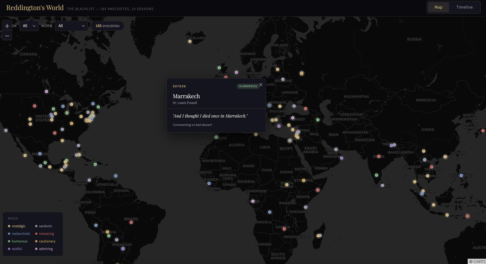

# 🎯 Reddington's World

**Every personal anecdote Raymond "Red" Reddington tells across 10 seasons of *The Blacklist* — extracted, geocoded, and visualized.**

👉 **[Live demo](https://YOUR_USERNAME.github.io/reddingtons-world/)**



---

## What is this?

Throughout *The Blacklist*, Raymond Reddington constantly shares personal anecdotes — short stories from his past, often set in exotic locations. *"I died once in Marrakech..."*, *"Years ago, in Damascus..."*, *"I was once on the island of Ko Ri, free-diving in the Andaman Sea..."*

This project extracts all of them from episode transcripts, geocodes the locations, parses temporal references, and presents them as:

- **Interactive map** — 185 anecdotes pinned across 162 unique locations worldwide, color-coded by mood
- **Timeline** — 59 datable anecdotes arranged chronologically, reconstructing Red's "unofficial biography" from childhood through the final season

## Pipeline

```
Episode transcripts → LLM extraction → Deduplication → Geocoding → Cleanup → Visualization
     (scraping)        (Claude API)      (Jaccard)      (Nominatim)  (manual)     (Leaflet)
```

### Data collection
- Scraped full-text transcripts for all 218 episodes from subslikescript.com
- Chunked into overlapping 1,500-word windows (200-word overlap) to avoid splitting anecdotes at boundaries

### Extraction
- Each chunk sent to Claude Sonnet via API with a structured extraction prompt
- Extracted: verbatim text, locations, persons, temporal hints, narrative context, mood classification
- 983 chunks processed, ~$5 total API cost

### Post-processing
- Jaccard similarity deduplication (threshold 0.6) for overlapping chunks
- Geocoding via Nominatim with manual corrections for 25+ misidentified locations (e.g., "Dingle" → Ireland not Philippines, "Patagonia" → Argentina not Arizona)
- Temporal parsing: converted 164 time hints ("when I was 17", "in '91", "29 years ago") into approximate years
- Relevance filtering: removed non-anecdotes (plot exposition, one-liners without stories)

### Result
| Metric | Count |
|--------|-------|
| Episodes processed | 218 |
| Raw anecdotes extracted | 428 |
| After cleanup | 386 |
| With map coordinates | 185 |
| Unique locations | 162 |
| With datable time reference | 59 |
| Year range | 1943–2022 |

## Tech stack

| Component | Technology |
|-----------|-----------|
| Scraping | Python, BeautifulSoup |
| Extraction | Claude API (Sonnet), structured JSON prompts |
| NLP | Named entity recognition, temporal parsing, mood classification |
| Geocoding | geopy / Nominatim |
| Data cleaning | pandas, custom correction pipeline |
| Visualization | Leaflet.js, vanilla JS, CARTO dark tiles |
| Hosting | GitHub Pages (single HTML file, no build step) |

## Mood distribution

The extraction classifies each anecdote by the mood in which Red delivers it:

| Mood | Count | Description |
|------|-------|-------------|
| 🟡 Nostalgic | 51 | Fond memories, often bittersweet |
| ⚪ Sardonic | 44 | Dry wit, dark humor |
| 🔵 Melancholic | 22 | Loss, regret, pain |
| 🔴 Menacing | 18 | Threats disguised as stories |
| 🟢 Humorous | 18 | Genuinely funny anecdotes |
| 🟠 Cautionary | 15 | Warnings through parable |
| 🟣 Wistful | 13 | Longing for the past |
| 🩷 Admiring | 4 | Respect for someone's abilities |

## Running the pipeline yourself

```bash
# 1. Scrape transcripts
pip install requests beautifulsoup4
python scrape_transcripts.py

# 2. Extract anecdotes (requires Claude API key)
pip install anthropic geopy pandas
export ANTHROPIC_API_KEY='sk-ant-...'
python extract_anecdotes.py --transcript-dir ./transcripts/

# 3. Clean up
python cleanup_anecdotes.py anecdotes.csv
```

Pipeline scripts are in the [`pipeline/`](pipeline/) directory.

## Local development

No build step. Just open `index.html` in a browser:

```bash
open index.html
# or
python -m http.server 8000
```

## License

Data extracted from *The Blacklist* transcripts. Character quotes are property of their respective copyright holders and are used here for fan/educational purposes under fair use. The extraction pipeline, analysis, and visualization code are MIT licensed.

---

*A data science portfolio project combining web scraping, NLP/LLM extraction, geocoding, and interactive visualization.*
